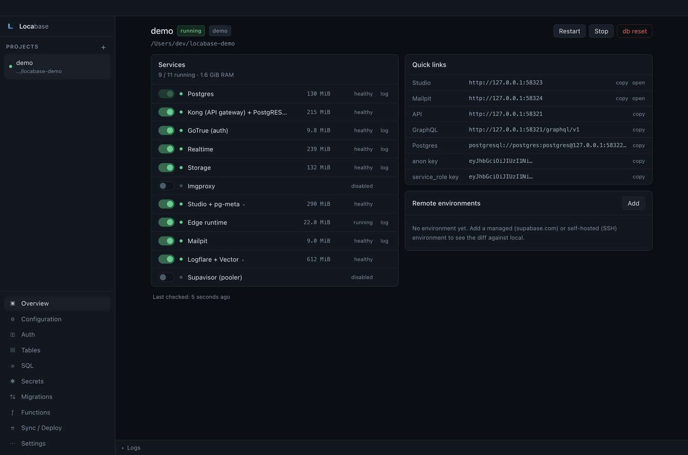
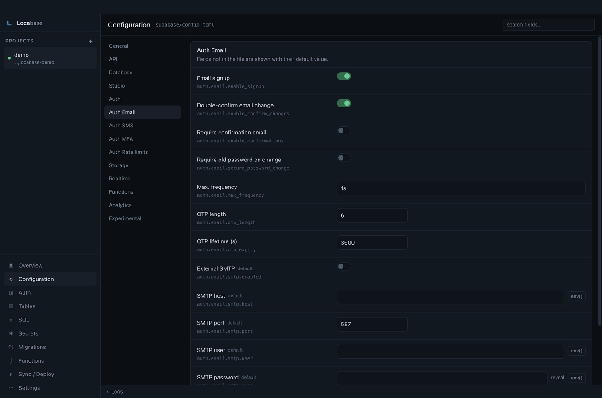
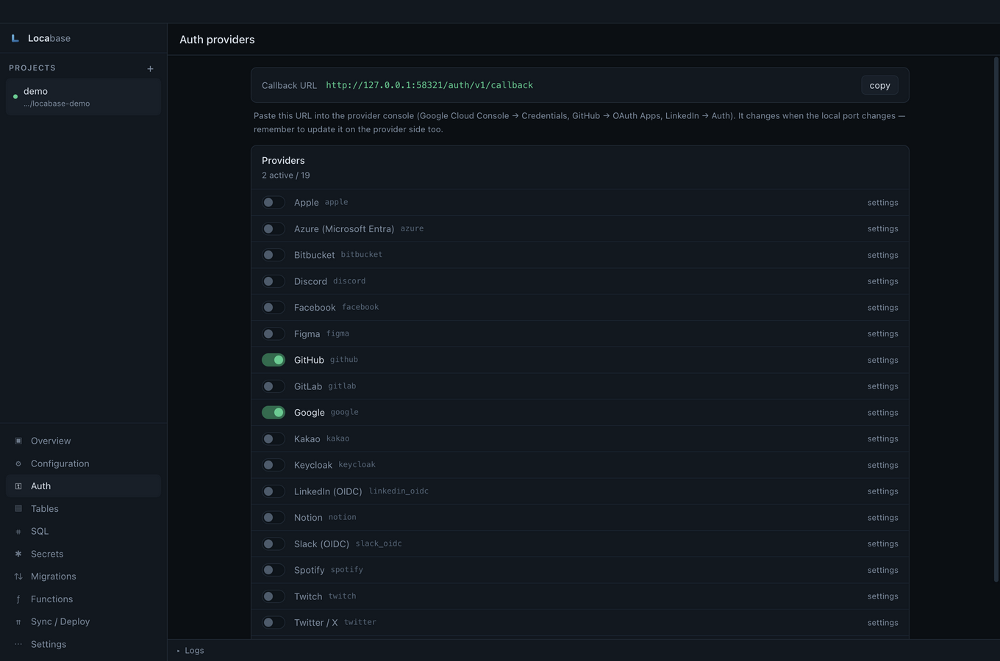
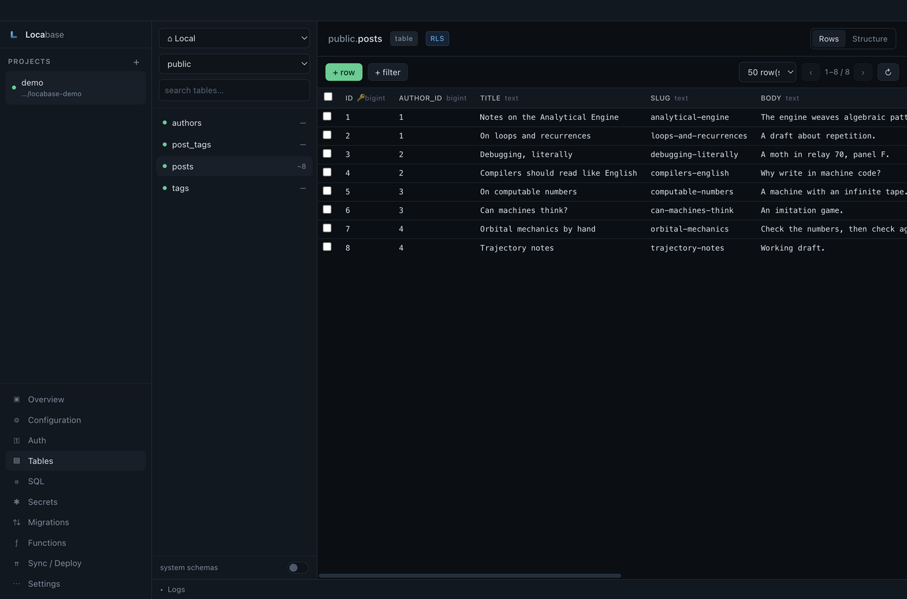
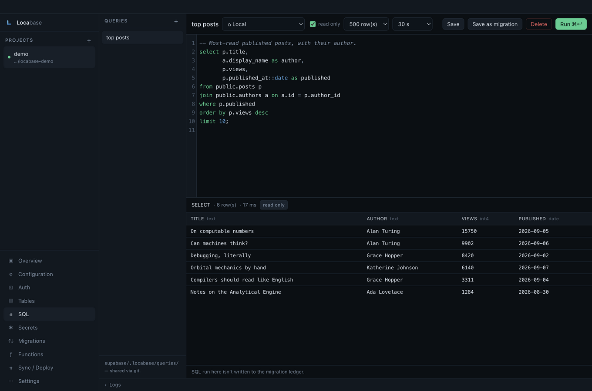
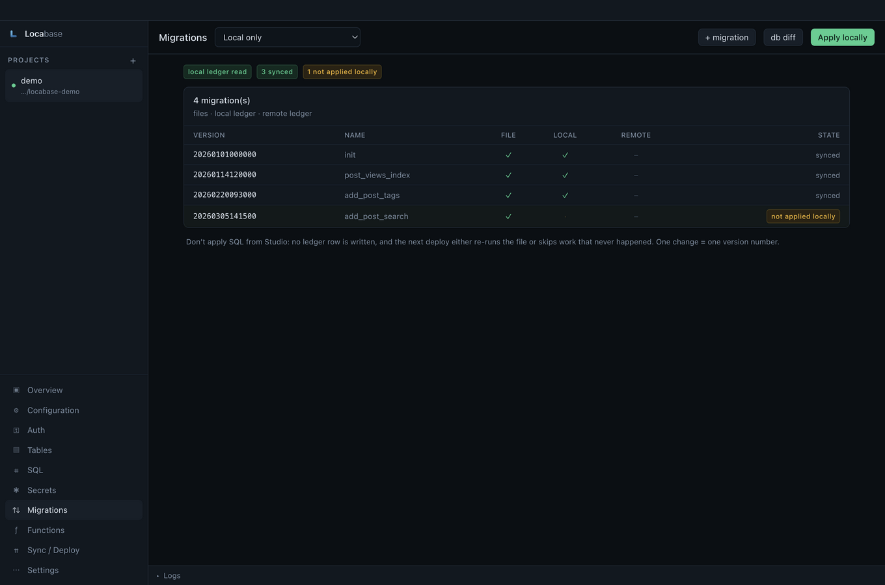
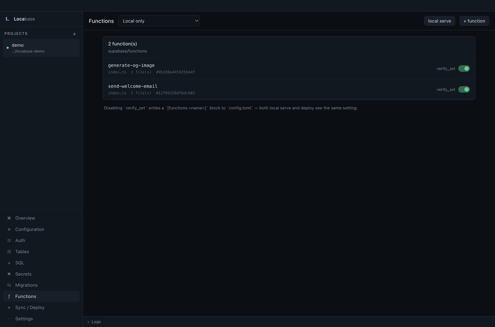
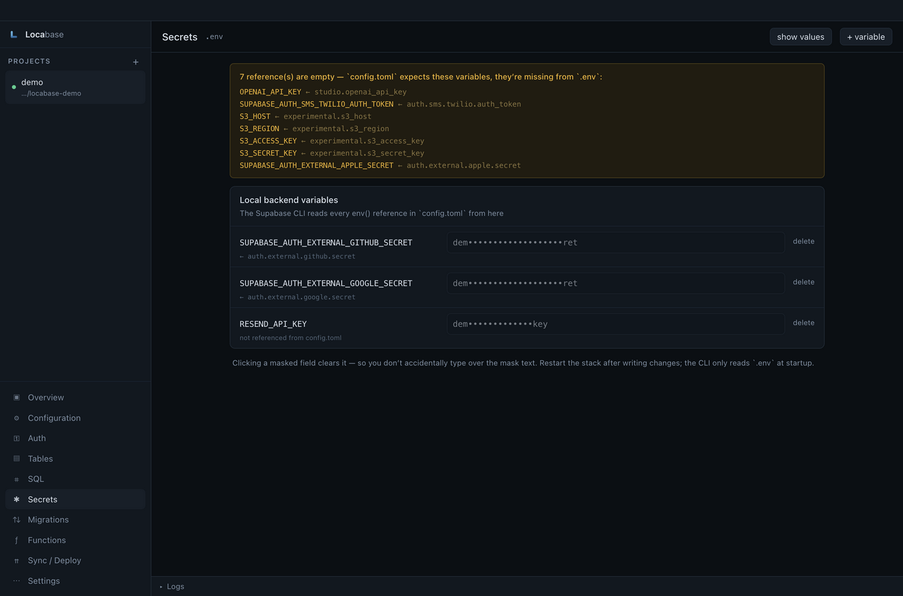

<div align="center">


# Locabase

**A desktop control room for Supabase.** Run the local stack, edit
`config.toml` through a real UI, and see — then deploy — the difference between
local and your managed or self-hosted project.

[](LICENSE)
[](https://github.com/elchinabilov/Locabase/actions/workflows/ci.yml)


[English](README.md) · [Azərbaycanca](README.az.md)

</div>



## Why Locabase exists

Self-hosted Supabase Studio doesn't give you screens for auth providers, secrets,
or edge functions. Those settings live in `supabase/config.toml` — a 400-line
file you edit by hand, restart the stack, and hope you got right.

Locabase turns that file into a form, and adds the thing the CLI can't show you:
**what is actually different between your laptop and your server**, across
migrations, schema, functions, secrets and auth — with a per-file diff and a
selective deploy.

It manages any number of projects, and each project can have any number of
remote environments — managed (supabase.com) or self-hosted over SSH.

## What each screen does

| Screen | What it gives you |
| --- | --- |
| **Overview** | Service toggles (on/off) with **per-container RAM**, start/stop/restart/`db reset`, links to Studio · Mailpit · API · DB, and port-collision warnings |
| **Configuration** | 108 `config.toml` fields as a form in 14 groups, with a diff preview before writing and a restart banner when one is needed |
| **Auth** | 19 OAuth providers, the callback URL computed for you, `env()` wiring to your `.env` |
| **Secrets** | A root `.env` editor with masking, plus the list of references `config.toml` expects but `.env` doesn't have |
| **Tables** | Schema/table browser, row viewing (filter, sort, paginate), row create/edit/delete, and structure (type, PK, FK, default) |
| **SQL** | CodeMirror with schema autocompletion and ⌘↵, read-only enforced server-side, multi-statement results, queries saved into the repo, "save as migration" |
| **Migrations** | Files · local ledger · remote ledger side by side, with new/up/diff/repair |
| **Functions** | List, create from a template, serve locally, `verify_jwt`, deploy one or all |
| **Sync / Deploy** | The diff across five axes, **file-by-file content diffs for functions**, selective deploy, dry run, and on/off plus RAM for remote containers |

### Configuration — the file as a form



Every field shows the `config.toml` path it writes, whether the value is a
literal or an `env()` reference, and whether changing it needs a restart. You see
the diff before anything touches the file — and the write itself is surgical:
only the value's byte range changes, so comments and ordering survive.

### Auth — the screen self-hosted Studio doesn't have



19 providers, each with the fields it actually needs. The callback URL is derived
from your local API port, so you can copy it straight into the provider console.
Secrets are stored as `env()` references, never inline.

### Tables and SQL — one environment picker, two tools



The table editor is guided: row CRUD, no DDL. Schema changes belong in a
migration file, otherwise your ledger and your database drift apart. Tables
without a primary key are read-only (no `ctid` fallback — `ctid` changes after
every `UPDATE` and every `VACUUM FULL`, so it can update the wrong row).



The SQL editor is the power tool: full SQL, schema autocompletion, per-statement
results, a row limit and a statement timeout. **Read-only is on by default** and
resets every time you open it — and it's enforced by the server, not by
inspecting your SQL. Saved queries are ordinary `.sql` files under
`supabase/.locabase/queries/`, committed so your team shares them.

Both screens default to **local** and stay there; a remote environment is only
used when you explicitly pick one.

### Migrations and functions — drift, made visible



Three sources are read separately — the files on disk, the local ledger, the
remote ledger — and none is inferred from another. That's how you see a migration
that exists as a file but was never applied, or a ledger row whose file is gone.



Each function shows a content hash, so "does this need deploying?" has a real
answer. On self-hosted, the md5 of every remote file arrives in **one** ssh call,
so the state is exact — same / different / missing — not guessed from a version
number.

### Secrets — the references that aren't filled in



Every `env()` reference in `config.toml` is resolved against your root `.env`,
and the ones that resolve to nothing are listed at the top — which is usually the
answer to "why did auth stop working after I restarted?".

## Install

**Requirements:** the [`supabase` CLI](https://supabase.com/docs/guides/local-development),
Docker (or OrbStack), and — for self-hosted environments — `ssh` and `rsync`.
Locabase checks all of them under **Settings → Environment check**.

```bash
git clone https://github.com/elchinabilov/Locabase.git
cd Locabase
npm install
npm run dev
```

Build an installer:

```bash
npm run dist:mac   # arm64 .dmg
npm run dist:win   # x64 NSIS installer
```

> **Builds are unsigned and not notarized**, and there is no auto-update.
> On macOS, Gatekeeper will complain the first time; open it from the context
> menu, or build from source.

## Adding a project

The **+** in the sidebar offers two paths:

- **New project** — runs `supabase init` in the folder you choose, derives
  `project_id` from the name you give, and moves the ports into a **free block of
  100** (543xx taken? then 553xx, 563xx…), so a new stack never collides with an
  existing one. `migrations/`, `functions/`, `seed.sql` and `supabase/.gitignore`
  are filled in afterwards.
- **Open existing project** — registers a folder that already has
  `supabase/config.toml`. Nothing is copied and nothing is changed.

If the folder already holds a project, "New project" refuses to overwrite it and
offers to add it as-is instead.

## How it works

Three design decisions are worth knowing before you read the code.

**The `config.toml` patcher never re-serializes.** The file is scanned once to
find where each key's *value* starts and ends; a change replaces only that byte
range. Before writing, the result is re-parsed and every patch verified against
its expected value — on a mismatch, nothing is written. Every write leaves a
`.bak`.

**Remote work goes through one adapter interface.** Managed uses the CLI plus the
Management API; self-hosted uses the system `ssh` binary with `docker exec` and
`rsync`, so your `~/.ssh/config`, ssh-agent and `known_hosts` behave exactly as
they do in your terminal.

**Secrets never become command-line arguments** — they travel over stdin, or a
0600 temporary file. Every log line passes through `redact()`. Tokens live in the
OS keychain via Electron `safeStorage`.

More detail: [architecture](docs/architecture.md) · [security model](docs/security.md) ·
[translation](docs/i18n.md).

## Interface language

English by default, Azerbaijani available in Settings. The choice is stored in
`localStorage`. See [docs/i18n.md](docs/i18n.md) to add a language.

## Tests

```bash
npm run typecheck
npm test
```

145 tests, run against three real `config.toml` files: the TOML patcher, the
`.env` editor, the SQL builders and CSV parsing, identifier quoting, log
redaction, saved-query path safety, the service catalog and the translation
dictionaries.

## Known limitations

- **No selective migration apply on managed projects** — `supabase db push`
  applies everything pending. The deploy confirmation warns you.
- **No remote comparison for auth configuration yet.** Managed uses
  `supabase config push`; self-hosted reads the server's `.env`.
- **A multi-statement script is one implicit transaction** (unlike `psql`): if
  the third statement fails, the first two roll back too.
- **The row limit is applied after the result reaches the main process**; on a
  very large `select`, the statement timeout hits first.
- **The table editor uses offset pagination**, so far pages of a large table are
  slow. Keyset pagination is future work.
- **Builds are unsigned**, not notarized, and there is no auto-update.

## Contributing

Issues and pull requests are welcome — start with
[CONTRIBUTING.md](CONTRIBUTING.md). Comments, identifiers and tests are English;
user-facing strings go through `t()`. Security problems go to
[SECURITY.md](SECURITY.md), not a public issue.

## License

[Apache License 2.0](LICENSE) © 2025 Elchin Abilov.

Locabase is an independent project. It is not affiliated with, endorsed by, or
sponsored by Supabase Inc.; "Supabase" is their trademark and is used here only
to describe compatibility.
